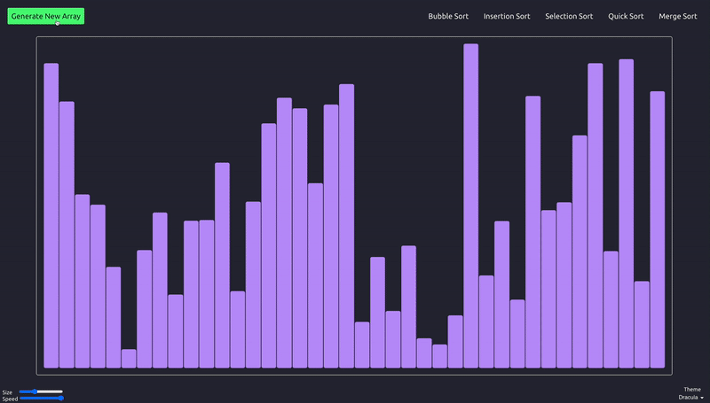
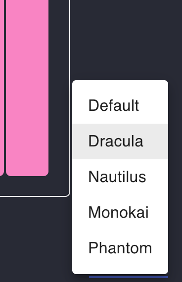
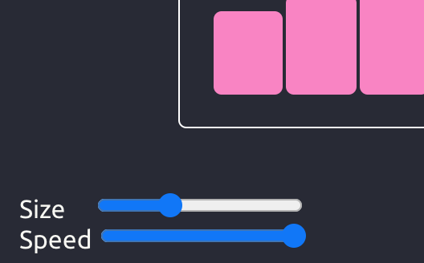

# Sort-By-New

An interactive way to visualize popular sorting algorithms!

### Technologies
  * [React](https://reactjs.org/)
  * [JavaScript](https://www.javascript.com/)
  *  [CSS](http://www.css3.info/)
  *  [MaterialUI](https://material-ui.com/)

## Features
   ### Theme Chooser
   React context was used to create a list of themes which change the display colors of the application
   
 
   ### Adjustable animation speed and array size
   
   
## Challenges

The two most significant challenges were:

1- creating the sorting algorithms themselves, since an animations array needed to be created which managed each individual color change, bar height change, and swap. This is an example using bubble sort:
[challenge2](ReadMeImages/challenge2.png)

2- creating the logic for the frontend on the button click of each sort, making sure that the array was copied, reset, and animated with appropriate button style changes during rendering the animations. This is an example of that logic for merge sort:
[challenge1](ReadMeImages/challenge1.png)
